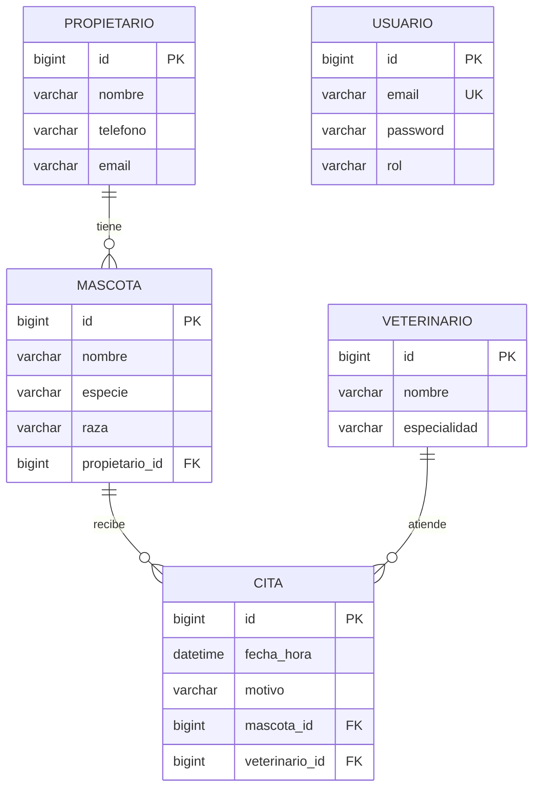

# Modelo y responsabilidades

Ademas, citas tiene UNIQUE(veterinario_id, fecha_hora). Usuario representa al personal que utiliza la API; no es un propietario ni un veterinario. El doctor Andres no inicia sesion en este MVP.

La llave foranea queda del lado muchos: mascotas.propietario_id, citas.mascota_id y citas.veterinario_id. Las relaciones son unidireccionales porque los casos de uso no necesitan navegar colecciones desde Propietario o Veterinario. Los DTO evitan exponer entidades y ciclos JSON.

## Flujo de una cita

HTTP POST /api/citas -> Spring Security -> CitaController (@Valid) -> CitaService -> repositorios -> MySQL -> CitaDTO -> 201.

El servicio comprueba fecha, precision de minutos, mascota, veterinario y horario. La base de datos garantiza integridad incluso si dos solicitudes llegan simultaneamente. La conversion a DTO ocurre dentro de la transaccion.

## Palabras que aparecen en el proyecto

| Palabra | Que significa aqui |
| --- | --- |
| API | La aplicacion que recibe solicitudes y devuelve respuestas |
| Endpoint | Una operacion de la API, como GET /api/citas |
| JSON | El formato de texto usado para enviar y recibir datos |
| Entidad | Una clase que representa una tabla, como Mascota |
| DTO | Los campos que se reciben o devuelven en una solicitud |
| Repositorio | La parte del codigo que consulta y guarda datos |
| Transaccion | Un grupo de cambios que se confirma completo o se deshace si falla |
| Llave foranea | Una columna que apunta al id de otra tabla |
| Token | El valor que recibes al iniciar sesion y envias para identificarte |
| Prueba con mock | Una prueba que sustituye una dependencia; por ejemplo, no consulta MySQL real |

## Conceptos para la defensa

- pom.xml declara dependencias, Java y construccion; VetTurnoApplication inicia Spring Boot.
- application.properties configura la ejecucion: MySQL, Hibernate, JWT y errores.
- JPA define el contrato de persistencia; Hibernate lo implementa; JpaRepository ofrece operaciones de acceso a datos.
- El controller traduce HTTP; el service aplica reglas; el repository accede a MySQL.
- La inyeccion por constructor hace explicitas las dependencias y permite sustituirlas por dobles en pruebas.
- Autenticar comprueba identidad; autorizar decide permisos.
- BCrypt verifica una contrasena comparandola con un hash; no la descifra.
- Un JWT esta firmado, no cifrado. No contiene contrasenas ni secretos.
- Stateless significa que cada solicitud presenta su Bearer token, sin sesion HTTP.
- @Valid activa las restricciones de los DTO; declarar anotaciones sin validar la entrada no basta.
- OpenAPI describe la API; Swagger UI permite inspeccionarla y probarla.
- La persistencia despues de reiniciar requiere una demostracion con MySQL; un test con mocks no la demuestra.

## Por que el manejador global no reemplaza la seguridad

GlobalExceptionHandler traduce excepciones de los controllers y servicios: validacion y negocio a 400, autenticacion del login a 401 y fallos imprevistos a 500 con mensaje generico. No decide quien puede acceder a una ruta.

Spring Security actua antes del controller mediante su cadena de filtros. JwtAuthFilter valida firma y expiracion y carga la identidad. SecurityConfig aplica los roles. SecurityErrorHandler implementa AuthenticationEntryPoint y AccessDeniedHandler para devolver el mismo ApiError ante 401 y 403 producidos en esa cadena.

## Decisiones de implementacion para estudiar

La arquitectura por capas mantiene responsabilidades pequenas y explicitas. Los servicios son clases concretas: no se agrega una interfaz por servicio cuando solo hay una implementacion. Los mapeos a DTO son metodos breves y no necesitan otra biblioteca.

- Los DTO usan `record` de Java 17 para representar datos inmutables con constructor y accesores. Las entidades son clases porque JPA necesita gestionar su estado y un constructor sin argumentos.
- `@Transactional` delimita las escrituras. Las consultas usan `readOnly = true`; la conversion a DTO ocurre dentro de esa transaccion para acceder a las relaciones LAZY.
- `@EntityGraph` en la agenda carga mascota, propietario y veterinario para construir la respuesta sin consultar cada relacion por separado.
- La consulta previa de horario permite dar un mensaje claro. La restriccion UNIQUE en MySQL evita que dos solicitudes simultaneas creen el mismo horario; `saveAndFlush` permite detectar esa restriccion dentro del servicio.
- Inyectar `Clock` permite usar hora de Colombia y fijar el tiempo en las pruebas sin esperar a que cambie el reloj real.
- El filtro JWT valida el token y carga el usuario. La configuracion de seguridad decide los permisos. Su registro automatico como filtro del contenedor se desactiva para que se ejecute solamente en la cadena de Spring Security.

Para estudiar el codigo, sigue primero una solicitud: controller, service y repository. Despues revisa las entidades, los DTO y las reglas de seguridad de esa misma solicitud.

Las listas no tienen paginacion y la consulta de mascotas puede hacer consultas adicionales para cargar sus propietarios. Son limitaciones a considerar si aumenta el volumen de datos. No afectan la regla de horarios ni sustituyen las pruebas del taller.

## Fuentes tecnicas consultadas

- [Spring Boot: requisitos](https://docs.spring.io/spring-boot/system-requirements.html).
- [springdoc: integracion con Spring Boot](https://springdoc.org/).
- [JJWT: documentacion oficial](https://github.com/jwtk/jjwt).
- [Spring Security: DaoAuthenticationProvider](https://docs.spring.io/spring-security/reference/servlet/authentication/passwords/dao-authentication-provider.html).
